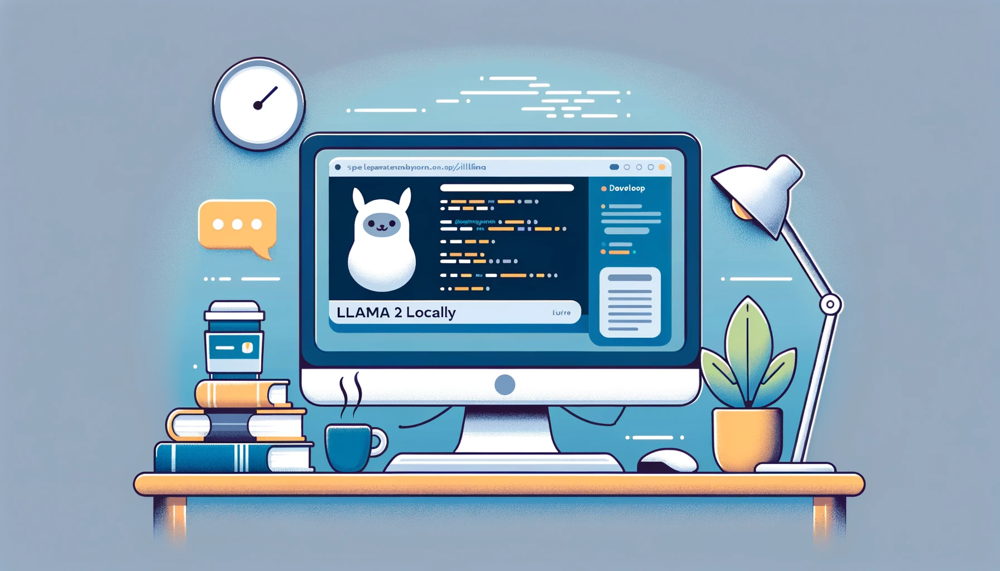

# Running LLama 2 locally with LangChain



This tutorial is dedicated to guiding you through the process of setting up LLama 2 for local execution, integrated with LangChain — a versatile framework designed for building applications powered by language models. We'll explore the steps and considerations involved in creating a robust local development environment for your language model applications

For enthusiasts looking to dive deeper into the world of LLMs, or for those who desire a more hands-on and unrestricted experimentation environment, setting up LLama 2 to run locally with LangChain presents a rewarding pathway. This approach not only offers greater flexibility but also allows for more creative freedom in your development process

## Step 1 - Download LLama 2 from Meta
 1. Go to [Meta AI site](https://ai.meta.com/resources/models-and-libraries/llama-downloads/) and provide request access information to download the LLama 2 model. Meta will send you and email with the instruction to download the model.

 2. Clone the [LLama Repository](https://github.com/facebookresearch/llama) and run the download.sh script. 
 
 3. The download script will ask for your unique custom URL which is included in the email from Meta AI. When prompt for model, following the instruction and select the smallest model Llama-2-7b-chat.


## Step 2 - Quantize Llama model with llama.cpp

Quantization is a technique used to optimize the model's performance, particularly in terms of its size and speed. It involves reducing the precision of the numbers (weights and activations) used within the model. Let's break down what this means and its implications:

Normally, neural network weights and activations are stored in 32-bit floating-point format. Quantization typically reduces this to 16-bit, 8-bit, or even lower bit representations.

By using lower-precision formats, the amount of memory required to store the model is significantly decreased. Lower precision numbers require less computational resources to process. This can lead to faster computation times, which is suitable running LLM development on laptop.

There is a link to learn more about quantize Llama model in the resources section below if you want to learn more about it.

To quantize Llama model and run on a laptop, [llama.cpp](https://github.com/ggerganov/llama.cpp) is used in this case to run LLaMA model using 4-bit integer quantization. 

### Clone the llama.cpp repository
```
git clone https://github.com/ggerganov/llama.cpp.git
cd llama.cpp
```

### Compile llama.cpp by running the make, CMake or gmake
```
make
```

### Convert LLama 2 model
Create a python 3.11.x and activate virtual environment in this code repo to install the dependency to run the conversion and running Jupyter notebooks.
```bash
python3 -m venv .
source .venv/bin/activate
```

Copy the downloaded LLama 2 7b-chat model files to the llama.cpp models folder
```bash
cp -r [path-to-llama-2-folder]/llama-2-7b-chat [path-to-llama.cpp]/models
```

Install python dependencies that are needed for the conversion. In the llama.cpp folder, run the following
```bash
python -m pip install -r requirements.txt
```

Convert the model and do a test run
```bash
# convert llama 2 7b chat model to ggml FP16 format
python convert.py models/llama-2-7b-chat/

# quantize the model to 4-bits (using q4_0 method)
./quantize ./models/llama-2-7b-chat/ggml-model-f116-.gguf ./models/llama-2-7b-chat/ggml-model-q4_0.gguf q_0

# run the inference to test the conversion
./main -m ./models/llama-2-7b-chat/ggml-model-q4_0.gguf -n 128
```

## Step 3 - Develop a Simple LLM Conversation Notebook with LLama 2 model and LangChain that Run Locally
LangChain is a framework for developing applications powered by language models. You can learn more about LangChain [here](https://python.langchain.com/docs/get_started/introduction).

It is pretty simple to using LangChain to develop a simple conversation application with LLama 2 model that quantized on step 2. The following are the general approach with LangChain.

1. Create a conversation template
2. Create and initialize LLM model
3. Create and initialize a LLM chain with the template and model initialized on step 1 and 2 above
4. Ask simple questions to the LLM

The following section of the code is where you specified the LLama 2 model you quantized.
```python
from langchain.chains import LLMChain
from langchain.llms import LlamaCpp

# If you following the instruction and use the q4_0 model, you path should be: [UPDATE_AND_PUT_YOUR_PATH_TO_MODEL_HERE]/llama.cpp/models/llama-2-7b-chat/ggml-model-q4_0.gguf
# the folloiwing code use the q5_0 model
llm = LlamaCpp(
    model_path="[UPDATE_AND_PUT_YOUR_PATH_TO_MODEL_HERE]/llama.cpp/models/llama-2-7b-chat/ggml-model-q5_0.gguf",
    temperature=0.25,
    n_gpu_layers=2,
    n_batch=512,
    n_ctx=2048,
    f16_kv=True,
    verbose=True,
)
```

**You can find the entire code example on this notebook [Running-llama-locally.ipynb](./Running-llama-locally.ipynb) in this repo**

## Resources:
  - [Meta LLama 2](https://ai.meta.com/llama/)
  - [Quantize Llama models with GGML and llama.cpp](https://towardsdatascience.com/quantize-llama-models-with-ggml-and-llama-cpp-3612dfbcc172)
  - [LangChain](https://python.langchain.com/docs/get_started/introduction)