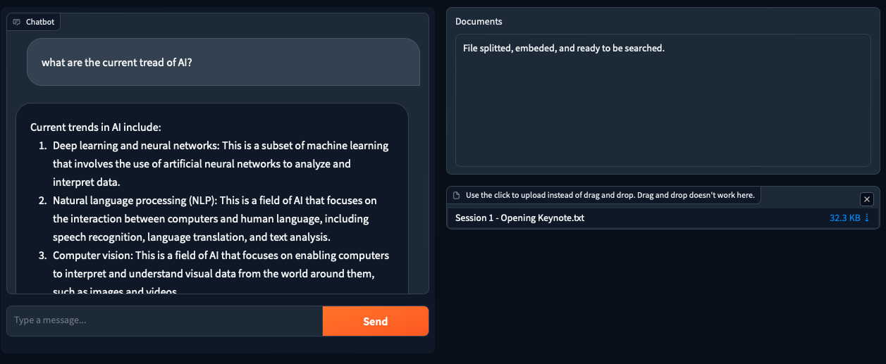

# RAG / LLama 2 / Gradio

Building simple web LLM chat interface interact with LLM and RAG (Retrieval Augmented Generation) running locally. RAG finds the most relevant content or document you specified, and use those extra context for LLM to answer the initial query. Simple RAG itself is easy to understand and to do, but it can become complicated or complex when you going for an enterprise deployment. This step only focus on running simpel RAG and will share more about complex RAG when ready in the future.

There are more advance ways to do RAG such as sentence window retrieval and hierachical with auto merging retrieval methods that this example won't cover.

- [Example 1: Load, Split, Embed Text Document and Store in Chroma Vector Store](#example1)
- [Example 2: Use YouTube transcripts Document Loader](#example2)
- [Example 3: RAG with PDF file](#example3)
- [Example 4: RAG Interactive UI with Gradio](#example4)


## What is RAG?
RAG stands for "Retriever-Augmented Generation." This model architecture is designed to enhance the capabilities of generative models by combining them with a retrieval system. The concept is central to advancing the performance of language models in tasks that require external knowledge or specific information that might not be contained within the training data of the model itself.

### How It Works:


*Image from official langchain docs*

1. Documents such as text files, PDFs, web pages, and etc. are loaded, splitted, and embeded to store in Chroma vector database.
2. When a query or prompt is given to the system, the retriever first searches through its knowledge base to find relevant information.
3. This information is then passed to the generative model.
4. The generative model uses its understanding of language and context, along with the retrieved information, to generate a response.


### Advantages:

1. **Improved Accuracy and Relevance**:
   - By accessing a broader range of information, the model can provide more accurate and contextually relevant responses, especially for factual queries.

2. **Handling Dynamic Information**:
   - If the retriever accesses up-to-date databases or the internet, the system can provide information that is current, which is a significant advantage over standalone generative models that are limited to their training data.

3. **Enhanced Flexibility**:
   - This approach combines the creative and linguistic strengths of generative models with the factual and up-to-date knowledge retrieval ability, offering a more powerful tool for various NLP tasks.

## <a name="example1">Example 1:</a> [Load, Split, Embed Text Document and Store in Chroma Vector Store](./rag-chroma-simple-text.ipynb)
This example uses Chroma as its vector store. [Chroma](https://docs.trychroma.com) is an open-source embedding database that is light weight, easy to setup, and use in LLM development that need to run locally. For embedding, the LlamaCppEmbeddings from llama-cpp-python is used to embed document.

### Sample Text Data
This example uses 9 of the Youtube videos' transcripts from [Gartner IT Symposium/XPO 2023](https://www.youtube.com/results?search_query=gartner+it+symposium%2Fxpo+2023). These videos' transcripts are copied into a text files to be used later in load, split, and embeddings.

### Load and Split Youtube Videos' Transcripts Text
The average number of words in a sentence we talk is about 15 to 20 words, average 5 characters in a word, and about 3 to 6 sentences in a paragraph. This example load the text and the split the text with the chunk size to 350 which is about the same that a person speak in a paragraph with 25 characters overlapping.

```python
transcript_docs = TextLoader('../sample-data/gartner-events/Session 1 - Opening Keynote.txt').load()
text_spliter = RecursiveCharacterTextSplitter(
    chunk_size=350,
    chunk_overlap=25,
    length_function=len,
    add_start_index=True,
)
```

### Text Embedding
To embed the text, this example use the LlamaCppEmbeddings from the llama-cpp-python. It takes about 4 to 5 minutes to embed the entire Gartner Symposium/XPO opening keynote transcript.

```python
from langchain.embeddings import LlamaCppEmbeddings

embeddings = LlamaCppEmbeddings(
    model_path="[PATH_TO_MODEL]/llama.cpp/models/llama-2-7b-chat/ggml-model-q5_0.gguf",
    verbose=False,
    )
```

Text embedding is a technique used to convert categorical data, such as words, sentences, or entire documents, as well as other types of data, into vectors of real numbers. These embeddings are designed to capture the relationships and semantic meanings of the original data, facilitating their use in various machine learning models, especially neural networks.

The following code use embed the text and store in the Chroma database.
```python
from langchain.vectorstores import Chroma

documents = text_spliter.split_documents(transcript_docs)
vectorstore = Chroma.from_documents(documents, embeddings)
```

To see how the vector restriever works, you can query with a question and see whether the result meaning is close to the question you ask. This is just a simple search without using any LLM to generate answer.
```python
query = "What the current trend in AI?"
docs = vectorstore.similarity_search(query, k=3)
print(docs[0].page_content)
print(docs[1].page_content)
print(docs[2].page_content)
```

> Sasha died of cancer about a year and a half after he
died six-year-old Nadia was playing with a math app on her iPad and this app had
a chatbot on it called the wishing well the idea was that it could interact with

> two flavors of AI and how to become AI ready but there's something most people
are are missing and it's this AI is not just a technology it's not just a
business Trend it is actually a profound shift in the relationship between humans

> your number one AI responsibility is security if there's one thing you should
do right now is to create a policy on the acceptable use of public generative
AI systems 100% of organizations need this at the beginning of this

Langchain hub provides a simple RAG prompt template this example use for question and answer with the context retrieved from vector database to the LLM.
```python
prompt_template = """
You are an assistant for question-answering tasks. Use the following pieces of retrieved context to answer the question. If you don't know the answer, just say that you don't know. Use three sentences maximum and keep the answer concise.
Question: {question} 
Context: {context} 
Answer:
"""
```

This example use the Question and Answer Retriever along with the LLM to generate the answer of the question being asked based on the vector search result used as the contxt.
```python
qa_chain = RetrievalQA.from_chain_type(
    llm, 
    retriever=vectorstore.as_retriever(), 
    chain_type_kwargs={"prompt": prompt},
)

question = "What the current trend in AI?"
result = qa_chain({"query": question})
result["result"]
```

By setting the debug to True, you can see the context being used in the context as shown below.
```log
[chain/start] [1:chain:RetrievalQA > 3:chain:StuffDocumentsChain > 4:chain:LLMChain] Entering Chain run with input:
{
  "question": "What the current trend in AI?",
  "context": "Sasha died of cancer about a year and a half after he\ndied six-year-old Nadia was playing with a math app on her iPad and this app had\na chatbot on it called the wishing well the idea was that it could interact with\n\ntwo flavors of AI and how to become AI ready but there's something most people\nare are missing and it's this AI is not just a technology it's not just a\nbusiness Trend it is actually a profound shift in the relationship between humans\n\nyour number one AI responsibility is security if there's one thing you should\ndo right now is to create a policy on the acceptable use of public generative\nAI systems 100% of organizations need this at the beginning of this\n\nagainst the Dark Side of AI okay we've covered a lot of ground today\njust look at the summary if we cut through the complexity the most important messages we want you to take"
}
```
The generated answer below shown how the context is being used by the LLM.
> Current trend in AI is the integration of AI into various industries and aspects of life, such as healthcare, finance, education, and security. It is not just a technology or business trend but a profound shift in the relationship between humans and machines. As an assistant, it is crucial to prioritize security and create policies for the acceptable use of public generative AI systems.'

## <a name="example2">Example 2:</a> [Use YouTube transcripts Document Loader](./rag-chroma-youtube-transcripts.ipynb)
In this example, the Youtube transcript loader is used directly to load the transcript data into the document.

```python
from langchain.document_loaders import YoutubeLoader

loader = YoutubeLoader.from_youtube_url(
    "https://www.youtube.com/watch?v=rVbvcIFeLYw&t=17s", add_video_info=False)
```

The prompt asked about the distruption in AI, and it kinds of gets the answer correct except it use the words distubances in response instead of distruption.


> There are several disturbances in AI that could have a significant impact, including:\n1. Generative AI: This technology has the potential to revolutionize industries such as entertainment, advertising, and media by creating highly realistic content.\n2. Explainable AI: As AI systems become more complex, it is essential to understand how they make decisions to ensure transparency and accountability.\n3. Digital Optimization: Customers are increasingly looking for ways to optimize their digital experiences rather than transforming them entirely.\n4. Pace of Engineering Innovation: The rapid pace of technological advancements in AI is driving innovation at an unprecedented level.\n5. Commercial Space FR Availability: As commercial space becomes more accessible, businesses will be able to explore new opportunities and markets.\n6. Business Readiness: Companies must prepare for the potential disruptions caused by AI and ensure they are ready to adapt quickly.\n7. Customer Needs: As customers' needs evolve, businesses must stay ahead of the curve to meet their expectations and remain competitive."


## <a name="example3">Example 3:</a> [RAG with PDF file](./rag-chroma-pdf.ipynb)
PDF is one of the most common file format (other than Excel) everyone get in our day to day work. Langchain itself support several different type of PDF libraries for text extraction. PyMuPDF seems to have many capabilities and speedy but its AGPL or commercial license might require additional license cost for enterprise or commercial projects. PDFPlumber is used in this example due to it has the capabilities to extract table that might need further explortation in future projects.

In this example, The Big Book of MLOps from Databricks PDF book is used due to its contents in various format such as text, list, tablular data, images, and etc.. It takes around 7 minutes to load, split content into chunks, embed, and store in vector database.

Different chunk_size is used, the bigger is better in this case since lengthy content provide better context in this case.
```python
text_spliter = RecursiveCharacterTextSplitter(
    chunk_size=1000,
    chunk_overlap=100,
    length_function=len,
    add_start_index=True
)
```

There are type of search when querying in vector database. I try both similarity and max marginal relevance (MMR) search and the result is a bit different with similarity search type return a better result in this case.
```python
qa_chain = RetrievalQA.from_chain_type(
    llm,
    retriever=vectorstore.as_retriever(search_type="similarity", search_kwargs={"k":2}), 
    # retriever=vectorstore.as_retriever(search_type="mmr", search_kwargs={"k":2}),
    chain_type_kwargs={"prompt": prompt},
)
```

Search result with similarity as its search type.
> MLflow is a platform for managing the end-to-end machine learning (ML) lifecycle. It provides a simple and consistent way to manage experiments, reproduce results, and deploy models. With MLflow, you can track and manage your ML workflows, including data preparation, model training, and model deployment.\nIn the context of AWS, Azure, or GCP, MLflow can be used to manage the entire ML workflow, from data preparation to model deployment, in a consistent and reproducible manner. This can help organizations to improve their ML development and deployment processes, and to ensure that their ML models are reliable, scalable, and secure.\nIn summary, MLflow is a platform for managing the end-to-end ML workflow, and it can be used in conjunction with AWS, Azure, or GCP to manage the entire ML workflow in a consistent and reproducible manner.

Search result with MMR as its search type.
> MLflow is a platform for managing the end-to-end machine learning (ML) lifecycle, including experimentation, model training, validation, deployment, and monitoring. It allows you to track experiments to record and compare parameters, metrics, and models, and provides features such as artifact management, model serving, and inference capabilities. MLflow supports a variety of ML libraries and frameworks, including TensorFlow, PyTorch, Scikit-learn, and more.\nIn the context provided, MLflow is being used in conjunction with Cloud Data Lake to manage the ML lifecycle for Dev, Staging, and Prod environments. This suggests that MLflow is being used as a platform for managing ML workflows across different environments, and that it is integrated with Cloud Data Lake to provide features such as artifact management and model serving.

## <a name="example4">Example 4:</a> [RAG Interactive UI with Gradio](./rag-chroma-gradio.ipynb)



This is a simple example of using Gradio to put a web user interface on top of the simple RAG build in previous example.

A slightly different prompt template as shown below is used this time for experiment purpose.

```python
prompt_template = """
[INST]<<SYS>> You are an assistant for question-answering tasks. Use the following pieces of retrieved context to answer the question. If you don't know the answer, just say that you don't know. Use three sentences maximum and keep the answer concise.<</SYS>> 

{context} 

Question: {question} 
Answer: [/INST]
"""
```

*Depend on the document size and hardware spec of the PC, it will take several minutes to split, embed, and store the content in the vector database.*